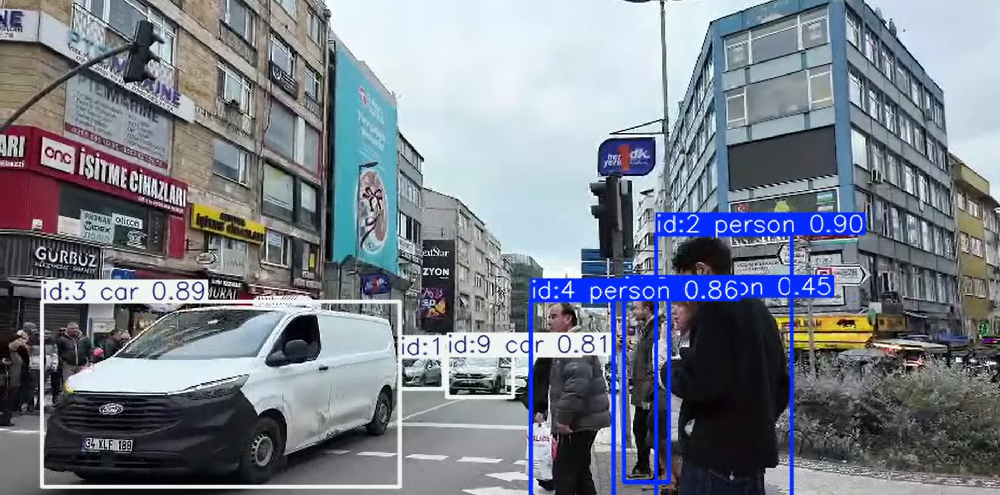

# Object Detection and Tracking

## 📌 Description
This project detects and tracks objects in a video using the YOLOv8 model and OpenCV.

## ✨ Features
- Detects multiple objects in a video
- Tracks detected objects frame by frame
- Draws bounding boxes around objects
- Saves the processed output video

## 🛠️ Technologies Used
- Python
- OpenCV
- Ultralytics YOLOv8

## ▶️ How to Run

Install dependencies:

```bash
pip install -r requirements.txt
```

Run the project:

```bash
python app.py
```

## 📷 Project Demo



## 🎥 Output

The processed video is saved inside the `output` folder.